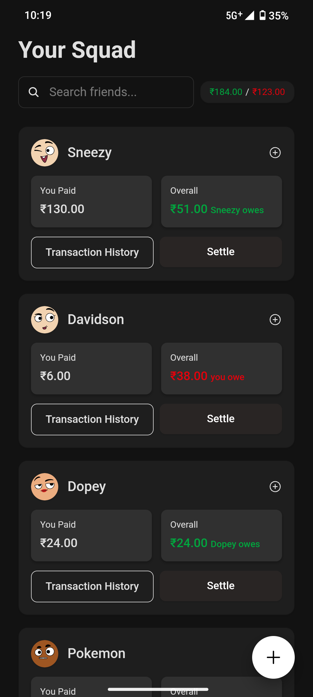
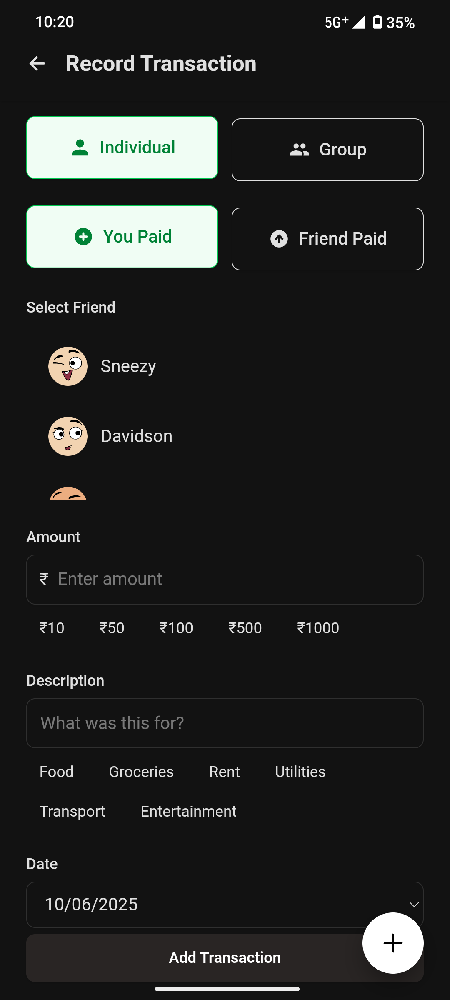
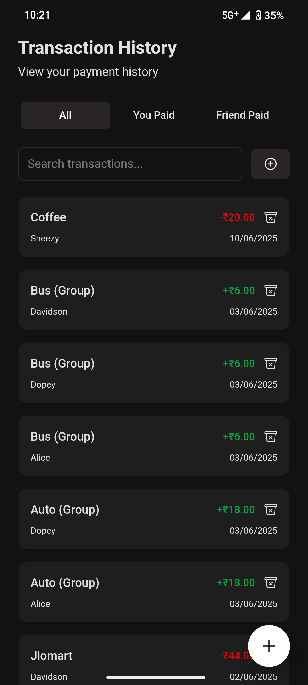

# Udhari - Expense Splitting Made Simple

<div align="center">
  
  <br />
  <p><strong>Easily split expenses with friends, roommates, and groups</strong></p>
  
  [](https://github.com/yourusername/udhari/releases)
  [](LICENSE)
</div>

<p align="center">
  
  &nbsp;&nbsp;&nbsp;
  
  &nbsp;&nbsp;&nbsp;
  
</p>

## Features
-  **Quick Expense Tracking** - Add expenses on-the-go with a few taps
-  **Smart Splitting** - Support for group transactions with muntiple split methods
-  **Settle Up** - Easy settlement suggestions to minimize transactions
-  **Fully Offline** - No internet required, all data stored locally on your device
-  **Zero Permissions** - No intrusive app permissions needed
-  **No Accounts Required** - Start using immediately with no sign-up process
-  **UPI Support** - For Indian users, Send upi payment link along with settlement message with amount and receiver details pre-filled
-  **Simple, Intuitive UI** - Clean design that's easy for anyone to use with Dark, Amoled, and Light themes
-  **Zero Ads, Zero Fees** - 100% free with no advertisements or any BS
-  **Open Source** - Built with love by the community, contributions welcome!

## What this app is not
-  **Not a splitwise replacement** - While it shares some features, Udhari is designed to be simpler and more focused on quick, offline expense tracking
-  **No Sharing or Cloud Sync** - Udhari is built for personal use so no synced data 
-  **No backup or restore** - Udhari does not support backup or restore functionality. if you uninstall the app, poof 
- **No Multi-Device Sync** - Udhari is designed for personal use on a single device, no syncing across devices

## When and how to use Udhari
Udhari is bult as a personal expense tracker for individuals to have a record of expenses or specifically Udhari (debts) with friends, roommates, or family members. just add members in app on inital setup and then from home screen you can add expenses with members, and Udhari will keep track of who owes what.


## Installation

### Android App

<a href="https://github.com/yourusername/udhari/releases/latest">
  
</a>

1. Download the latest APK from the releases page
2. Enable installation from unknown sources in your device settings
3. Open the APK file to install

> Apple peeps - soon (or contribute to make it happen!)


## Getting Started (Development)

### Prerequisites

- Node.js 18+ 
- npm or yarn
- Android Studio (for testing mobile features)

### Setup and Run

1. Clone the repository
```bash
git clone https://github.com/yourusername/udhari.git
cd udhari
```

2. Install dependencies
```bash
npm install
# or
yarn
```

3. Run the development server
```bash
npm run dev
# or
yarn dev
```

4. Open [http://localhost:3000](http://localhost:3000) with your browser to see the result.

### Building for Mobile

```bash
# Build for web and sync with Capacitor
npm run build:mobile

# Open in Android Studio
npm run open:android
```

## Contributing

Contributions are welcome! Please feel free to submit a Pull Request.

See [CONTRIBUTING.md](CONTRIBUTING.md) for development guidelines and how to set up your development environment.

## License

This project is licensed under the MIT License - see the [LICENSE](LICENSE) file for details.