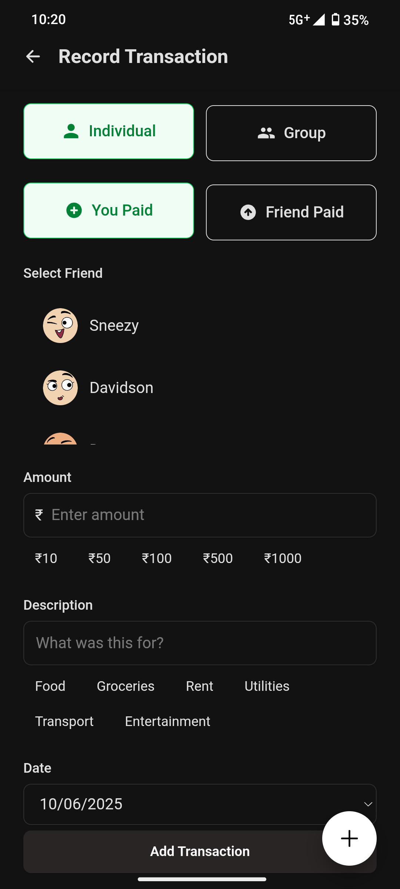

# Udhari App Screenshots

Here you can find screenshots of the Udhari app's key features and interfaces.

## Home Screen

  

## Add Transaction

  

## Transaction History

  

## Settle Up

  

## Settings

  

## Friends Management

  

